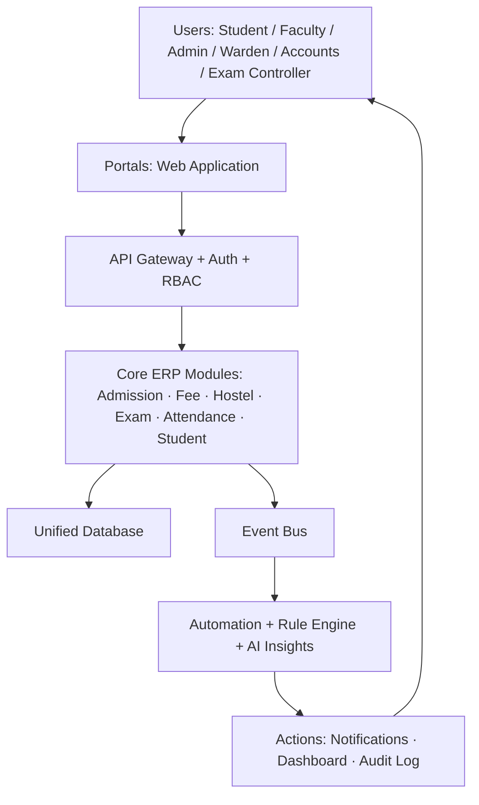
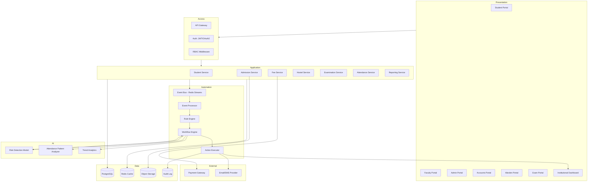

# CampusFlow AI — System Architecture
### SIH25103 · ERP-based Integrated Student Management System · Government of Rajasthan

---

## 0. Requirements Decomposition (Step 1)

**Functional requirements — REQUIRED by problem statement**
- Admissions management (application → verification → enrolment)
- Fee collection (payment, receipt, ledger, dues tracking)
- Hostel allocation (request, availability, room assignment)
- Examination records (registration, results, transcripts)
- Unified student information (single profile across modules)
- Reduce duplicate/manual data entry across departments
- Institution-wide visibility for administrators

**Functional requirements — OUR PROPOSED INNOVATION (not mandated, but justified)**
- Attendance management (feeds the "Smart Automation" theme directly)
- Faculty/Admin/Student role-based portals
- Event-driven workflow automation (payment → receipt → notification, etc.)
- Rule engine for deterministic policy checks (attendance threshold, fee due dates, eligibility)
- AI/ML analytics layer — restricted to advisory insights, not decisions
- Notification service (email/SMS)
- Institutional dashboard (real-time KPIs)
- Audit logging (every state-changing action)
- RBAC + security as a cross-cutting concern

**Non-functional requirements**
- Reliability > raw scale (single-institution deployment first, multi-tenant later)
- Data consistency for financial/academic records (ACID matters more than eventual consistency here)
- Auditability — every automated action must be traceable to the rule/event that triggered it
- Buildable by a small student team in a hackathon timeframe
- Human override on any AI-influenced decision

**Main actors**
Student, Faculty/Advisor, Admission Officer, Accounts Officer, Hostel Warden, Examination Controller, Institutional Admin, System (automated actor for scheduled/rule-triggered actions)

**Main modules**
Student, Admission, Fee, Hostel, Examination, Attendance, Notification, Reporting/Dashboard, Automation Engine (event processor + rule engine), Analytics (AI layer), Audit

**Data sources**
Admission forms, payment gateway callbacks, attendance capture (manual/biometric feed if available), examination records entered by controller, hostel occupancy data

**Important events**
`AdmissionSubmitted`, `AdmissionVerified`, `FeePaid`, `FeeOverdue`, `HostelRequested`, `RoomAllocated`, `AttendanceMarked`, `AttendanceThresholdBreached`, `ExamRegistered`, `ResultPublished`

**Automated workflows**
Fee payment → receipt → notify → dashboard update → audit
Attendance shortfall → flag → notify advisor + student → log intervention
Hostel request → availability check → auto-allocate if capacity exists → notify
Admission submission → validation → profile creation → downstream module sync

**AI/ML responsibilities (advisory only)**
- Attendance pattern / at-risk student detection (classification, not decision)
- Academic trend analysis for admin dashboards
- Fee-default risk scoring to help accounts team prioritize follow-up
- No AI component approves admissions, allocates hostels, or finalizes results

**External integrations (real, not invented)**
- Payment gateway (e.g., Razorpay/PayU-class UPI/card gateway)
- Email/SMS/push provider (e.g., SMTP + SMS gateway)
- Institutional SSO/identity if one already exists (optional, not assumed)

**Security requirements**
Authentication (JWT/OAuth2), RBAC per portal, encryption at rest and in transit, immutable audit trail, backup/recovery, input validation at API boundary, rate limiting

**Scalability requirements**
Must run comfortably for one institution (thousands of students) on modest infra; schema and service boundaries should not block future multi-institution/multi-tenant scaling, but that is explicitly NOT the hackathon MVP target.

---

## 1. Architecture Decision

**Selected architecture: Modular Monolith with an internal Event-Driven Automation Layer.**

Not microservices. Not pure layered CRUD. A single deployable backend, internally organized into strict modules (Student, Admission, Fee, Hostel, Examination, Attendance), that communicate through direct calls for synchronous operations and through an **internal event bus** for anything that should trigger automation (notifications, rule evaluation, audit, AI scoring).

---

## 2. Why This Architecture

- **Microservices rejected**: SIH25103 is a single-institution ERP problem, not a multi-team, independently-scaled system. Splitting Fee/Hostel/Exam into separate deployable services adds network calls, distributed transactions, and DevOps overhead a hackathon team cannot reliably build or demo in the available time. It also creates artificial single points of failure (service discovery, inter-service auth) that don't exist in the problem's actual scale.
- **Pure layered monolith (no events) rejected**: it would satisfy the ERP part but fail to genuinely demonstrate "Smart Automation" — everything would be a direct function call with no observable trigger→action chain for judges to point at.
- **Modular monolith + internal event bus fits**: one deployable unit (simple to build, simple to demo, ACID transactions stay easy for financial/academic data), while the internal event bus gives a clean, visible seam where "DATA → EVENT → RULES/AI → ACTION" actually happens — this is exactly what judges will ask to see. It also leaves a clean extraction path to real microservices later if the state government wanted to scale it across institutions, without over-building that now.
- **Reliability**: single database transaction boundary for core ERP writes avoids the classic distributed-systems failure modes a hackathon team can't afford to debug live.
- **Implementability**: a student team can build this with one backend codebase, one database, and a lightweight message queue (or even in-process pub/sub for the MVP), which is realistic in a hackathon timeframe.

---

## 3. Major Components

| Layer | Components |
|---|---|
| Presentation | Student Portal, Faculty Portal, Admin Portal, Accounts Portal, Hostel/Warden Portal, Examination Portal, Institutional Dashboard |
| Access/API | API Gateway (single backend entry), Auth Service, RBAC Middleware, Request Validation |
| Application/Business | Student Service, Admission Service, Fee Service, Hostel Service, Examination Service, Attendance Service, Reporting Service |
| Automation | Event Bus, Event Processor, Rule Engine, Workflow Engine, Action Executor |
| AI/Analytics | Risk Detection Model, Attendance Pattern Analyzer, Trend Analytics (all advisory) |
| Data | PostgreSQL (transactional), Redis (cache/session), Object Storage (documents), Audit Log Store |
| Integration | Payment Gateway, Email/SMS Provider |
| Security (cross-cutting) | Auth, Encryption, Audit Trail, Monitoring, Backup |

---

## 4. Layer-by-Layer Architecture

**Presentation Layer** — Seven role-scoped portals (React), all talking to one API Gateway. No portal talks directly to the database.

**Access/API Layer** — Single API Gateway (FastAPI/Node) does authentication (JWT), authorization (RBAC per route), and request validation before anything reaches business logic. This is the only entry point into the system.

**Application/Business Layer** — Six domain services inside the same deployable: Student, Admission, Fee, Hostel, Examination, Attendance. Each owns its own tables but shares the Student entity as the anchor. Services call each other directly (in-process) for synchronous needs (e.g., Fee Service reads Student Service for profile data) and emit events for anything downstream should react to asynchronously.

**Automation Layer** (the core differentiator) — Every state-changing action in a business service publishes a domain event to the Event Bus. The Event Processor consumes events, the Rule Engine evaluates deterministic conditions (e.g., "attendance % < 75"), the Workflow Engine sequences the resulting steps (notify → log → optionally involve AI advisory), and the Action Executor performs the final action (send notification, update dashboard, write audit entry).

**AI/Analytics Layer** — Subscribes to the same event stream (attendance events, fee events) but only ever produces a *score or flag*, written back as advisory metadata. It never calls the Action Executor directly for high-stakes actions — those always route through a human-review step for anything academic/financial.

**Data Layer** — One PostgreSQL instance for all transactional ERP data (strong consistency needed for fees/exams). Redis for session/cache and for the event queue in the MVP (Redis Streams) to avoid standing up Kafka/RabbitMQ infrastructure a hackathon doesn't need. Object storage for documents (admission certificates, ID proofs). A separate audit log table (append-only) for compliance.

**Integration Layer** — Payment Gateway (webhook into Fee Service), Email/SMS provider (called by Action Executor only, never by business services directly, so all outbound comms stay auditable in one place).

**Security Layer** — Not a box, a cross-cutting concern: JWT auth + RBAC at the gateway, TLS in transit, encryption at rest for PII, immutable audit log, rate limiting at the gateway, scheduled backups.

---

## 5. Data Flow — Five Workflows

**Workflow 1 — Admission**
Admission Form → API Gateway (validate) → Admission Service → Student Profile created → PostgreSQL write → `AdmissionSubmitted` event → Event Bus → Notification (applicant) + Dashboard update → Audit Log

**Workflow 2 — Fee Payment**
Payment Gateway webhook → Fee Service → Verification against expected amount → PostgreSQL write (ledger) → `FeePaid` event → Event Bus → Action Executor generates receipt → Notification (student) → Dashboard update → Audit Log

**Workflow 3 — Hostel Allocation**
Hostel Request (Student Portal) → Hostel Service → Availability Check (query Room table) → Allocation → PostgreSQL write → `RoomAllocated` event → Event Bus → Warden Portal update + Student Notification → Audit Log

**Workflow 4 — Examination**
Exam Registration → Examination Service → pulls Student + Attendance data → Rule Engine checks eligibility (e.g., min attendance) → Examination Record created with status (Eligible/Blocked) → Notification → Audit Log

**Workflow 5 — Smart Automation (attendance example)**
`AttendanceMarked` event → Event Bus → Rule Engine evaluates threshold → if breached, AI Analytics scores risk level (advisory) → Workflow Engine routes to **Human Review** (advisor/faculty) if risk is significant → on advisor confirmation, Action Executor sends alert to student + advisor → Intervention recorded → Audit Log

---

## 6. Automation Flow

```
EVENT (e.g., FeePaid, AttendanceMarked)
   → Event Bus (Redis Streams)
      → Event Processor (consumes, deduplicates)
         → Rule Engine (deterministic checks: thresholds, deadlines, eligibility)
            → [optional] AI Analytics (advisory score/flag only)
               → Workflow Engine (sequences next steps)
                  → [Human Review gate for high-stakes actions]
                     → Action Executor (notify / update record / update dashboard)
                        → Audit Log (immutable record of trigger + action + actor)
```

The Rule Engine and AI Analytics are deliberately kept as **separate, swappable stages** — rules are hand-authored policy (auditable, explainable), AI is statistical inference (advisory, never final).

---

## 7. AI/ML Role

**Rule-Based Automation (deterministic, always active)**
- Attendance threshold checks
- Fee due-date checks
- Exam eligibility checks
- Hostel capacity checks

**AI-Based Intelligence (advisory, human-reviewed)**
- At-risk student detection from attendance + academic trend data (classification model, e.g., logistic regression / gradient boosting on engineered features — appropriate for a hackathon, not deep learning theatre)
- Fee-default risk scoring to help accounts staff prioritize outreach
- Institutional trend summaries for the admin dashboard

**Hard boundary**: AI never allocates hostels, never finalizes exam eligibility, never approves admissions, and never sends a "final" disciplinary/academic notice without a human (advisor/admin) confirming the action first. This is enforced architecturally — the AI service has no write access to core ERP tables and no direct call path to the Action Executor for sensitive actions; it can only write to an `advisory_flags` table that the Workflow Engine reads.

---

## 8. Database Architecture

**Major entities**: Student, Department, Course, Faculty, Admission, Fee, Hostel, Room, Attendance, Examination, Notification, Workflow, Event, AuditLog

**High-level relationships**
- Student is the anchor entity: 1 Student → many Admission records (usually one), Fee records, Attendance records, Examination records, and at most one active Hostel/Room allocation.
- Department 1→many Course, 1→many Faculty.
- Course 1→many Examination records, referenced by Attendance.
- Room belongs to a Hostel block; Room 1→many allocations over time (history kept).
- Event and AuditLog are append-only logs referencing the entity/action they relate to (polymorphic reference: entity type + entity id).
- Workflow records link an Event to the sequence of Actions taken (for traceability/Q&A defense).

**Transactional vs analytical**
- Transactional (PostgreSQL, normalized): Student, Admission, Fee, Hostel, Room, Attendance, Examination, Notification — anything written by a user action or webhook.
- Analytical (read-optimized views / aggregated tables, refreshed from transactional data): dashboard KPIs, attendance trend summaries, fee-collection trend summaries. No separate data warehouse is justified at hackathon scale — materialized views over PostgreSQL are enough.
- Audit/Event logs: append-only, never updated, indexed by timestamp and entity reference.

---

## 9. Security Architecture (cross-cutting)

- **AuthN**: JWT-based session, issued at login, short-lived access token + refresh token.
- **AuthZ**: RBAC enforced at the API Gateway — every route mapped to allowed roles (Student, Faculty, Admin, Accounts, Warden, Exam Controller).
- **Encryption**: TLS 1.2+ in transit; sensitive fields (ID numbers, payment references) encrypted at rest.
- **Audit trail**: every state-changing action logged with actor, timestamp, action, and triggering event — immutable, append-only.
- **Data privacy**: student PII access scoped by role; accounts staff see financial data, not academic records, and vice versa, unless role explicitly permits both.
- **Backup/recovery**: scheduled PostgreSQL backups; documented recovery procedure (even if simple, for judge Q&A credibility).
- **Monitoring/logging**: centralized application logs + basic uptime/error monitoring, separate from the audit trail (audit = business record, logs = operational record).
- **Rate limiting**: at the gateway, to prevent abuse of public-facing endpoints (e.g., admission form submission).

---

## 10. Technology Stack

| Layer | Technology | Reason |
|---|---|---|
| Frontend | React (Next.js) | Fast to build role-based portals with shared components; strong hackathon familiarity |
| Backend | FastAPI (Python) | Fast to build REST APIs, natural fit with the Python-based AI/ML layer, good async support for the event consumer |
| Database | PostgreSQL | ACID guarantees needed for fee/exam records; mature, well-understood, free |
| Cache/Event Bus (MVP) | Redis (Streams) | Doubles as cache and lightweight event queue — avoids standing up Kafka/RabbitMQ infra unjustified at this scale |
| AI/ML | Python + scikit-learn | Sufficient for classification/scoring tasks (risk detection); avoids unjustified deep-learning complexity |
| Auth | JWT / OAuth2 | Industry-standard, stateless, easy to implement and explain |
| Object Storage | Any S3-compatible bucket | For admission documents/certificates |
| Deployment | Docker + a cloud VM/PaaS (e.g., Render/Railway/AWS free tier) | Simple, reproducible, demoable |

No message broker beyond Redis Streams is used — Kafka/RabbitMQ would be unjustified infrastructure weight for a single-institution MVP.

---

## 11. VERSION A — SIH PPT ARCHITECTURE (High-Level, one slide)

**Mermaid**


**ASCII**
```
        [ USERS: Student / Faculty / Admin / Warden / Accounts / Exam ]
                              |
                              v
                    [ PORTALS (Web App) ]
                              |
                              v
              [ API GATEWAY  +  AUTH  +  RBAC ]
                              |
                              v
        [ CORE ERP MODULES: Admission | Fee | Hostel | Exam |
                     Attendance | Student ]
                              |
                              v
                    [ UNIFIED DATABASE ]
                              |
                              v
                        [ EVENT BUS ]
                              |
                              v
        [ AUTOMATION: RULE ENGINE + AI INSIGHTS (advisory) ]
                              |
                              v
        [ ACTIONS: Notifications | Dashboard | Audit Log ]
                              |
                              v
                    [ BACK TO USERS ]
```

Boxes on slide (exactly 8, matching the 5–8 layer guideline): Users, Portals, API Gateway, Core ERP Modules, Unified Database, Event Bus, Automation+AI, Actions.
What NOT to show on Version A: no individual tables, no tech stack names, no ports/protocols, no internal rule syntax, no service-to-service call detail.
Emphasize visually: the "Core ERP Modules → Event Bus → Automation+AI → Actions" chain — that is the Smart Automation story.

---

## 12. VERSION B — TECHNICAL ARCHITECTURE (for technical Q&A)

**Mermaid**


**ASCII (condensed)**
```
PORTALS ---> API GATEWAY(Auth+RBAC) ---> APP SERVICES
                                            |     \
                                            |      -> PostgreSQL
                                            |      -> Redis Cache
                                            |      -> Object Storage
                                            v
                                        EVENT BUS
                                            |
                                    EVENT PROCESSOR
                                            |
                                       RULE ENGINE ----> AI MODELS (advisory)
                                            |                  |
                                            +---> WORKFLOW ENGINE <---+
                                                        |
                                                ACTION EXECUTOR
                                                 /       |        \
                                         NOTIFY      DASHBOARD   AUDIT LOG
                                       (Email/SMS)
```

---

## 13. Architecture-to-Problem-Statement Mapping

| SIH25103 Requirement | Covered By |
|---|---|
| Admissions | Admission Service + Workflow 1 |
| Fee collection | Fee Service + Payment Gateway integration + Workflow 2 |
| Hostel allocation | Hostel Service + Workflow 3 |
| Examination records | Examination Service + Workflow 4 |
| Unified student information | Student Service as anchor entity, single database |
| Reduce duplicate/manual entry | Single Student profile referenced by all modules; no re-entry across Admission/Fee/Hostel/Exam |
| Institutional visibility | Institutional Dashboard fed by Reporting Service + event-driven updates |
| Smart Automation theme | Automation Layer (Event Bus → Rule Engine → Workflow → Action) demonstrated in every workflow |

---

## 14. Architecture Weaknesses & Fixes

1. **Single PostgreSQL instance is a single point of failure.** Fix: documented backup schedule + read replica noted as a future scaling step (not built for MVP, but architecturally acknowledged).
2. **Redis Streams as event bus is lightweight and not built for massive throughput.** Fix: acceptable at single-institution scale; the module boundary is designed so it could swap to Kafka/RabbitMQ later without changing business service code.
3. **AI model quality depends on data volume the hackathon won't have.** Fix: ship the rule engine as the primary, always-working automation; present AI as an advisory add-on with a small demo dataset, explicitly scoped as "improves with more institutional data over time."
4. **Modular monolith could become a maintenance bottleneck if the team grows.** Fix: module boundaries (Student/Admission/Fee/Hostel/Exam/Attendance) are kept strict with no cross-module direct table access — this is what allows a clean future split into services if ever needed.
5. **Human-review gate for AI-flagged actions could be skipped under time pressure in a real deployment.** Fix: architecturally enforce it — AI service has no write path to core tables or the Action Executor for sensitive actions, only to an `advisory_flags` table.
6. **Multi-institution scaling isn't addressed by the MVP.** Fix: explicitly out of scope for the hackathon; call this out to judges as a deliberate MVP boundary, not an oversight.

---

## 15. Final Recommended Architecture

**CampusFlow AI = Modular Monolith (six domain services behind one API Gateway) + an internal Event-Driven Automation Layer (Event Bus → Rule Engine → optional AI advisory → Workflow Engine → Action Executor) sitting on a single PostgreSQL database, with Redis for cache/event-queue and clear cross-cutting security (JWT/RBAC/audit).**

This satisfies every mandatory SIH25103 requirement (admissions, fees, hostel, exams, unified student data, reduced duplicate entry, institutional visibility) while making "Smart Automation" a visible, explainable, judge-defensible architectural feature rather than a marketing label — every automated action can be traced back through Event → Rule/AI → Workflow → Action → Audit Log, and every AI-influenced action has a human review gate before it touches a student's academic or financial record.
